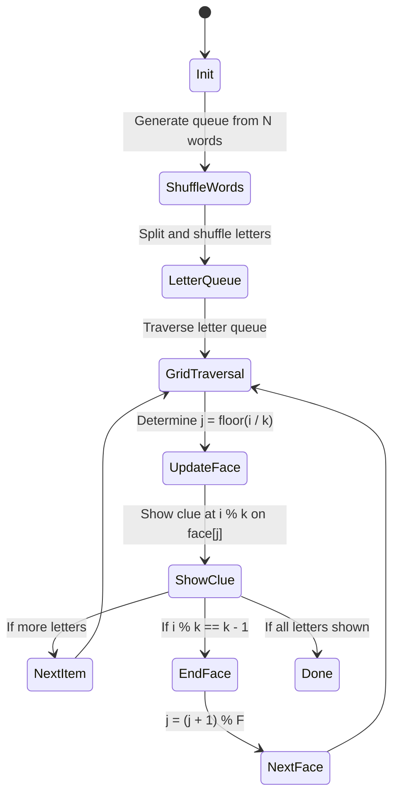

# 🧩 Sudoku Grid State Machine

This document describes the state machine used to control the flow of clue display in a Sudoku-style grid interface, with animated transitions driven by a shuffled queue of letter splits from words.

---

## 📋 Constraints

### Grid Animation

1. There are `N` words.
2. Each word `w` satisfies: `0 < w.length <= 50`.
3. A shuffled queue is generated from the letters of all words.
4. We traverse this queue, turning on one letter at a time.

### Clue Distribution

1. There are `F = 4` faces.
2. Each face `j` can have at most `k` clues, where `k <= N`.
3. For each letter in the letter queue, there is a matching clue queue item.
4. For face `j`, the clue index shown is `i % k`.
5. When at the last item (`i % k == k - 1`) of face `j`, we rotate to the next face `j + 1`.

---

## 🧠 State Machine Diagram (Mermaid.js)

