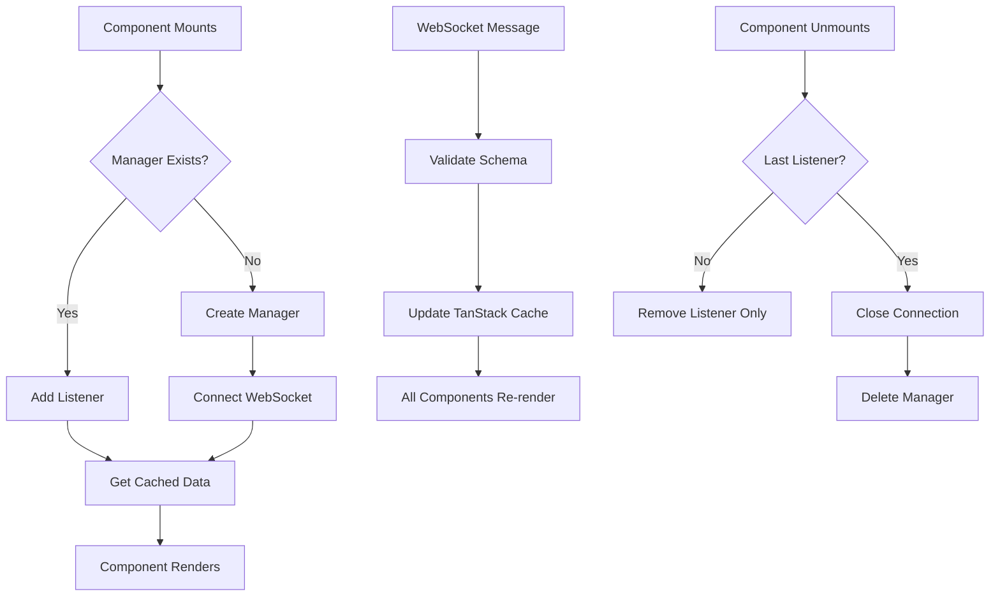

# WebSocket Lifecycle: Remounts, Reconnects & Persistence

## 🏗️ Architecture Overview

```
┌─────────────────┐    ┌──────────────────┐    ┌─────────────────┐
│   Component A   │    │  WebSocket       │    │  TanStack       │
│   (remounts)    │◄──►│  Manager         │◄──►│  Query Cache    │
└─────────────────┘    │  (global/shared) │    │  (persists)     │
┌─────────────────┐    │                  │    └─────────────────┘
│   Component B   │    │  - Connection    │              ▲
│   (remounts)    │◄──►│  - Listeners     │              │
└─────────────────┘    │  - State         │              │
┌─────────────────┐    └──────────────────┘              │
│   Component C   │              ▲                       │
│   (remounts)    │◄─────────────┘                       │
└─────────────────┘                                      │
                                                         │
                        ┌────────────────────────────────┘
                        │
                   ┌─────▼─────┐
                   │ Browser   │
                   │ Memory    │
                   │ (clears)  │
                   └───────────┘
```

## 📋 What Maps to What

### Global WebSocket Manager (In-Memory Class)

- **Maps**: `URL → WebSocketManager` instance
- **Stores**: Connection state, listeners, reconnect timers
- **Lifecycle**: Lives until all components unmount + cleanup

### TanStack Query Cache

- **Maps**: `QueryKey → Data[]`
- **Stores**: WebSocket messages/data
- **Lifecycle**: Follows TanStack Query caching rules

## 🔄 Lifecycle Scenarios

### Scenario 1: Component Remount (Connection Exists)

```typescript
// Component A using WebSocket
function ChatComponent() {
  const { data, isConnected } = useWebSocketQuery({
    url: "wss://api.com/chat",
    queryKey: ["chat", "room1"],
  })
  // Component unmounts, remounts
}
```

**What happens:**

1. ✅ **WebSocket stays connected** (other components still using it)
2. ✅ **TanStack cache persists** (data remains)
3. ✅ **New component gets cached data immediately**
4. ✅ **Listeners re-attach automatically**

### Scenario 2: All Components Unmount

```typescript
// Last component using this WebSocket unmounts
useEffect(() => {
  return () => {
    manager.cleanup() // Called when last listener is removed
  }
}, [])
```

**What happens:**

1. 🔌 **WebSocket connection closes**
2. 🗑️ **WebSocket manager instance deleted**
3. 💾 **TanStack cache may persist** (depends on cacheTime/staleTime)
4. ⚡ **Next component remount creates fresh connection**

### Scenario 3: Network Reconnection

```typescript
// Network goes down, comes back up
socket.onclose = () => {
  if (autoReconnect && !manualDisconnect) {
    setTimeout(() => this.connect(), reconnectInterval)
  }
}
```

**What happens:**

1. 🔄 **Auto-reconnection attempts** (idempotent)
2. 📡 **Connection re-established**
3. 💾 **TanStack cache data survives**
4. 🔗 **Components stay subscribed to cache**

### Scenario 4: Browser Refresh/Page Reload

```typescript
// User hits F5 or navigates away
window.addEventListener("beforeunload", () => {
  // All in-memory state is lost
})
```

**What happens:**

1. 🧹 **All WebSocket connections close**
2. 🗑️ **WebSocket managers destroyed**
3. 🗑️ **TanStack cache cleared** (unless persisted)
4. 🔄 **Fresh start on next page load**

## ⚡ What's Idempotent

### WebSocket Connection Management

```typescript
// Safe to call multiple times
manager.connect() // No-op if already connected/connecting
manager.addListener(callback) // Set-based, no duplicates
manager.removeListener(callback) // Safe even if not present
```

### Component Subscriptions

```typescript
// Multiple components can subscribe to same data
const { data } = useWebSocketQuery({
  queryKey: ["chat", "room1"], // Same key = shared data
})
```

### TanStack Query Operations

```typescript
// Safe to call multiple times with same key
queryClient.setQueryData(["chat", "room1"], newData)
queryClient.getQueryData(["chat", "room1"]) // Always returns latest
```

## 💾 What Persists

### During Component Remounts

- ✅ **WebSocket connection** (if other components using it)
- ✅ **TanStack Query cache** (configurable TTL)
- ✅ **WebSocket manager state**
- ✅ **Accumulated messages/data**

### During Network Disconnects

- ✅ **TanStack Query cache** (in browser memory)
- ✅ **Component subscriptions** (listeners)
- ❌ **WebSocket connection** (obviously)
- ❌ **In-flight messages** (lost during disconnect)

### During Browser Refresh

- ❌ **Everything** (unless explicitly persisted)

## 🎯 Persistence Strategies

### Option 1: TanStack Query Persistence

```typescript
import { persistQueryClient } from "@tanstack/react-query-persist-client"

persistQueryClient({
  queryClient,
  persister: createSyncStoragePersister({
    storage: window.localStorage,
  }),
})
```

### Option 2: Custom WebSocket State Recovery

```typescript
function useWebSocketQuery(options) {
  const { data } = useWebSocketQuery(options)

  // On reconnect, request state sync from server
  useEffect(() => {
    if (isConnected && wasDisconnected.current) {
      sendMessage({ type: "REQUEST_STATE_SYNC" })
    }
  }, [isConnected])
}
```

## 🔄 Reconnection Patterns

### Basic Exponential Backoff

```typescript
class WebSocketManager {
  private reconnectAttempt = 0
  private maxReconnectAttempts = 5

  private getReconnectDelay() {
    return Math.min(1000 * Math.pow(2, this.reconnectAttempt), 30000)
  }

  private scheduleReconnect() {
    const delay = this.getReconnectDelay()
    this.reconnectTimer = setTimeout(() => {
      this.reconnectAttempt++
      this.connect()
    }, delay)
  }
}
```

### Circuit Breaker Pattern

```typescript
class WebSocketManager {
  private failureCount = 0
  private circuitOpen = false

  connect() {
    if (this.circuitOpen && this.failureCount > 10) {
      console.log("Circuit breaker open, skipping connection")
      return
    }
    // ... connection logic
  }
}
```

## 🎮 State Management Flow



## 💡 Key Takeaways

1. **WebSocket Manager**: Global singleton, idempotent operations
2. **TanStack Cache**: Persists across remounts, shared between components
3. **Reconnection**: Exponential backoff is optimal for handling network interruptions
4. **State Recovery**: Plan for data loss during disconnects
5. **Component Independence**: Each component can mount/unmount without affecting others
